# Java Junction

## Introduction

This project is flask-based website that uses mongodb as the database for a coffee shop website for a UAB class. The database original was on the cloud but since this project is being made public it was switched to a local database still with mongodb. If you are interested in trying out the database locally on your pc then follow this guide on how to set up a local mongodb database and the project should run as long as you dont chang the connection type.
https://www.prisma.io/dataguide/mongodb/setting-up-a-local-mongodb-database#setting-up-mongodb-on-windows

On this website, you can make an account, login, view menu, and place an order. If you are an admin, you get the admin panel. On the panel you can view orders and add new items. The purpose of this was to learn more about web development as well as databases.

## Technologies

- Flask: We used flask because it allowed us to make a website in python. 
- HTML: It is needed to make a website.
- CSS: We used it for styling the website. 
- Javascript: We used this to show a map on the homepage for visual aesthetics.
- Jinja: We used this so we could have a navbar and footer on all our webpages with ease, page inheritance.
- Mongodb: We used Mongodb as our database because we wanted to use a non-SQL database.
- Github: We used this because it was a requirement, also to store and collaborate on the project. 
- Pymongo: We used this to connect to mongodb using python.

## Results

### Landing Page

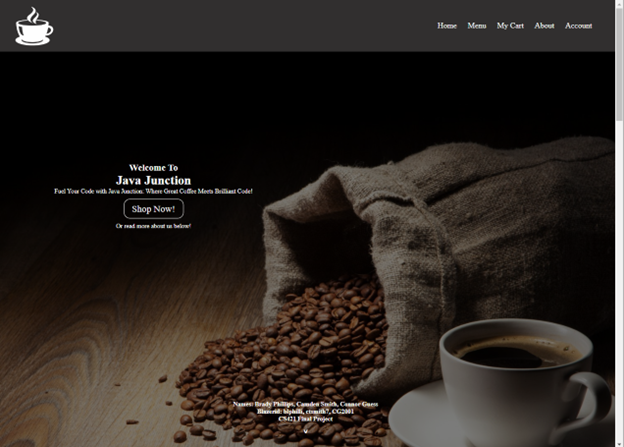
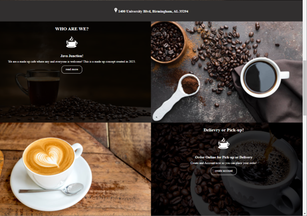
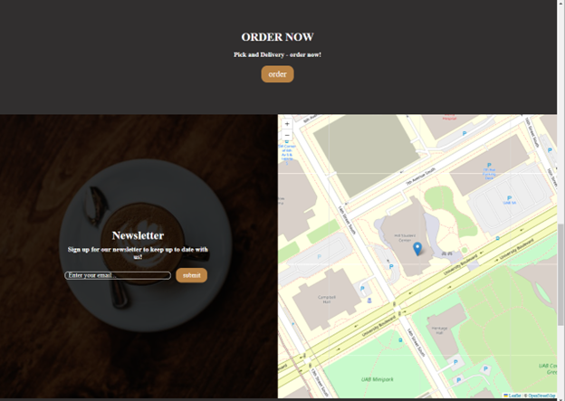
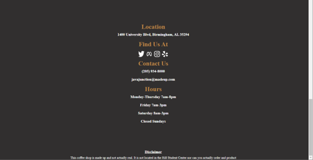

### Menu Page

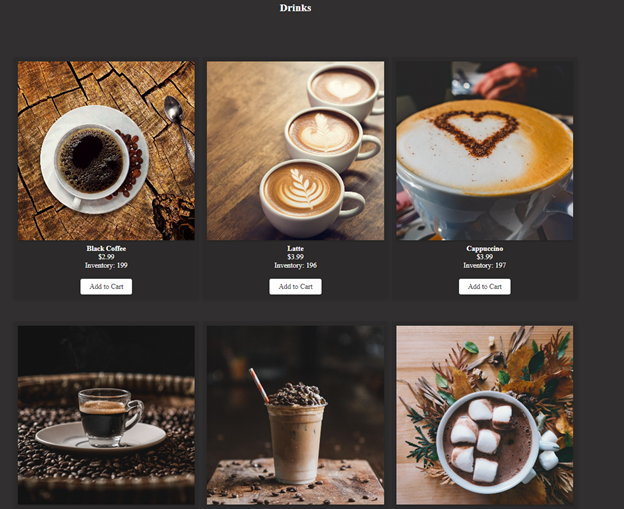
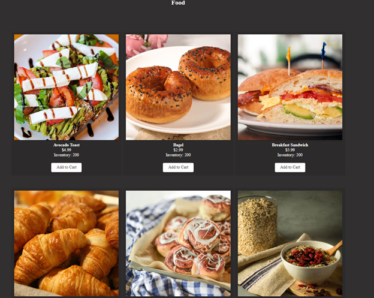
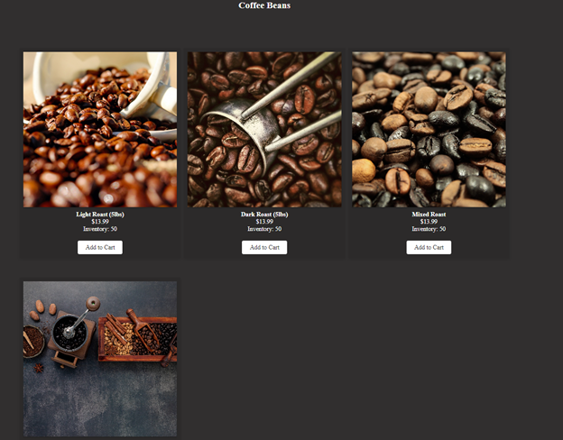
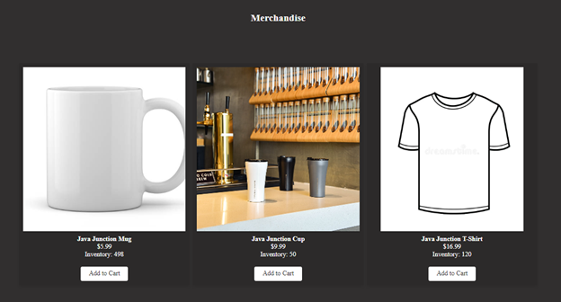

### About Page 

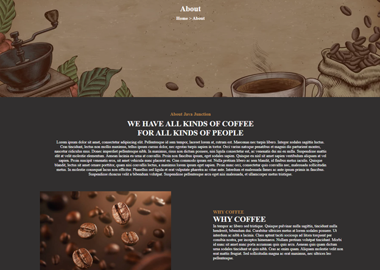

### Sign in Page

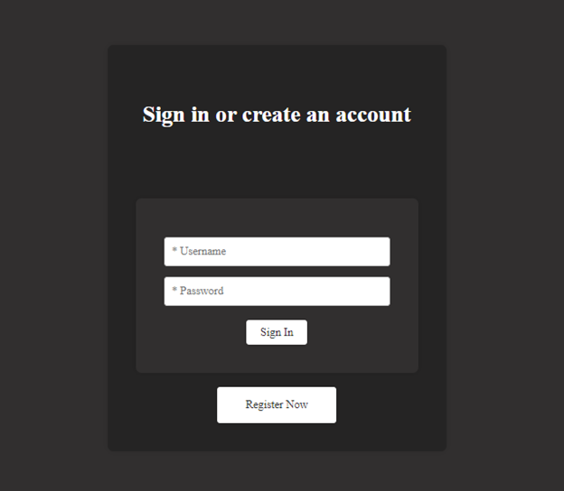
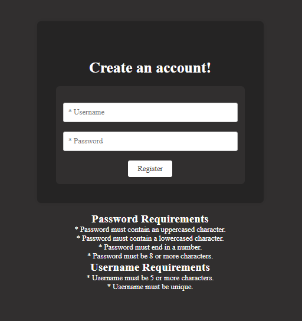

### Cart without items

### Cart with items

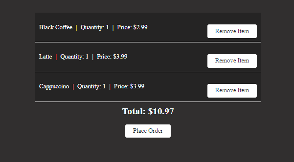

### Order Placed Page

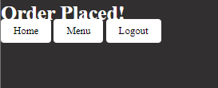

### Menu after order placed

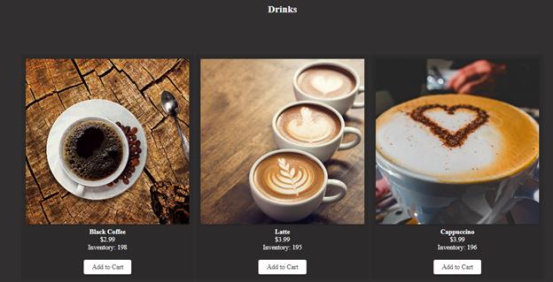

### Admin Dashboard

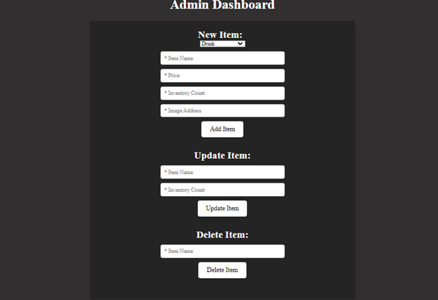
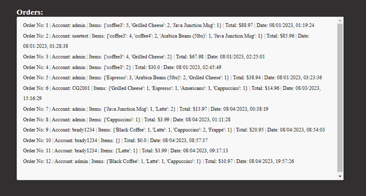

## Discussions/Future Works

Some future works include optimizing the code and possibly adding payment options, ad support, and start shipping internationally, AWS integration. 

## References

- Checking for numbers: https://stackoverflow.com/questions/19859282/check-if-a-string-contains-a-number
- Using POST and GET: https://pythonbasics.org/flask-http-methods/
- Standard HTML: https://stackoverflow.com/a/42791810 
- Flask sessions: https://www.geeksforgeeks.org/how-to-use-flask-session-in-python-flask/#
- Login form: https://www.w3schools.com/howto/howto_css_login_form.asp
- Database video: https://www.youtube.com/watch?v=c2M-rlkkT5o&ab_channel=BroCode
- Lorem ipsum text: https://www.lipsum.com/  
- Leaflet map: https://leafletjs.com/examples/quick-start/
- Pymongo docs: https://pymongo.readthedocs.io/en/stable/